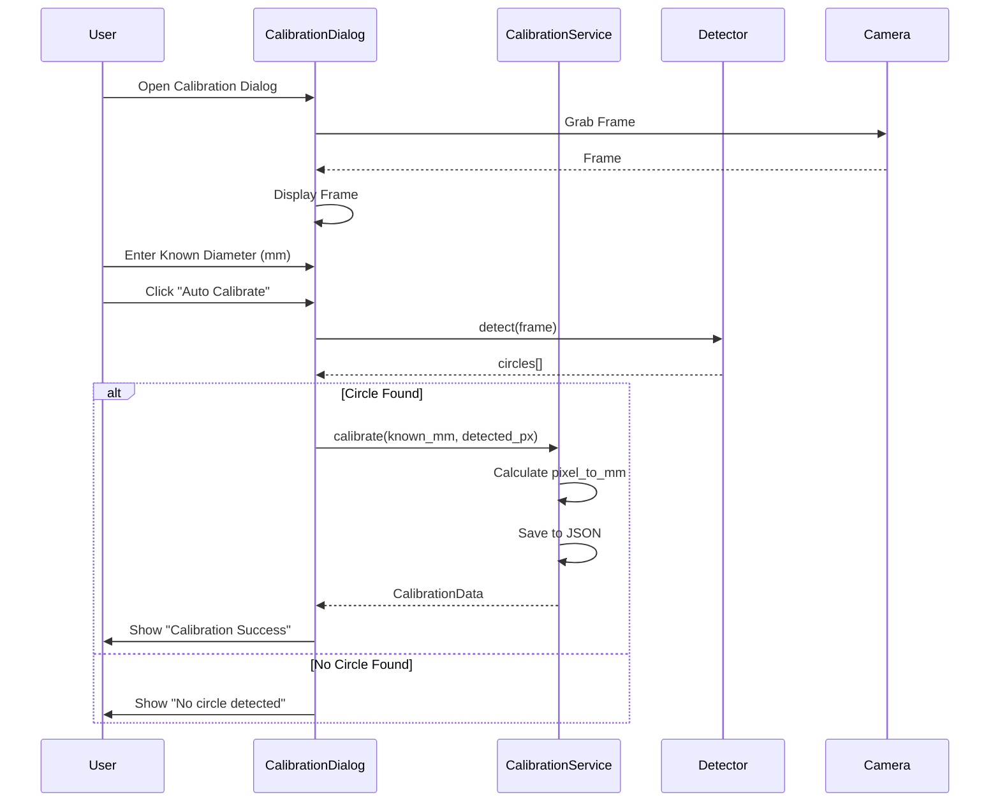
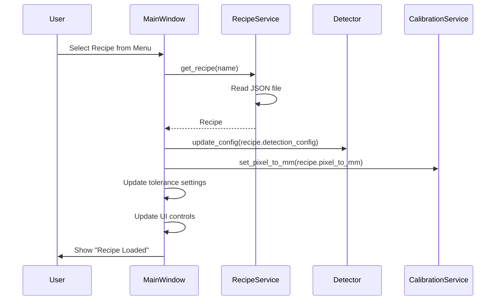
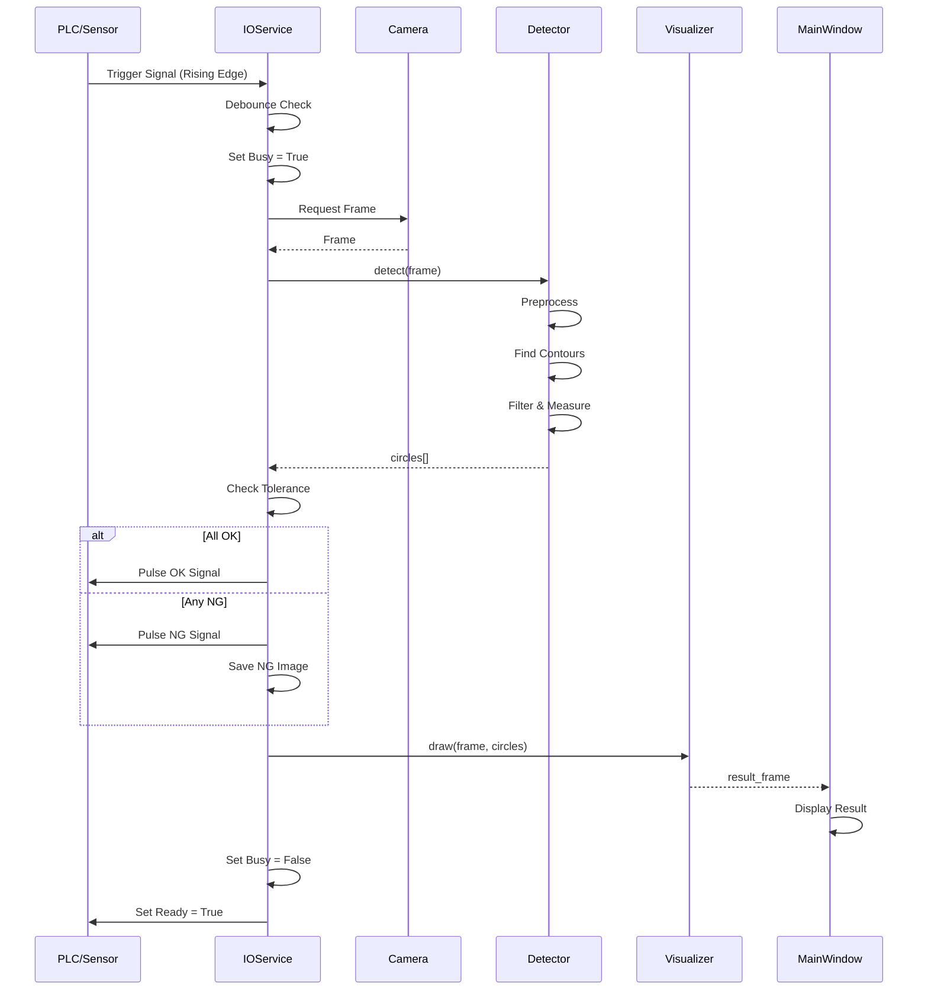
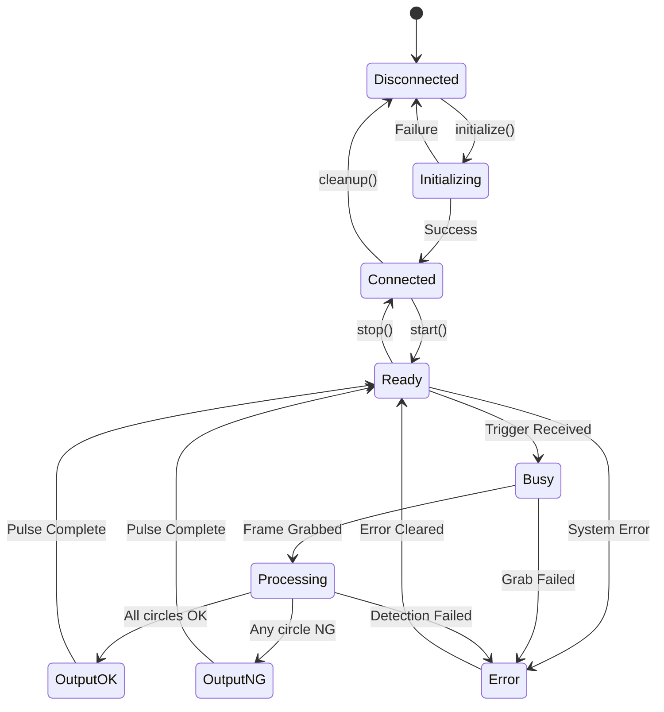
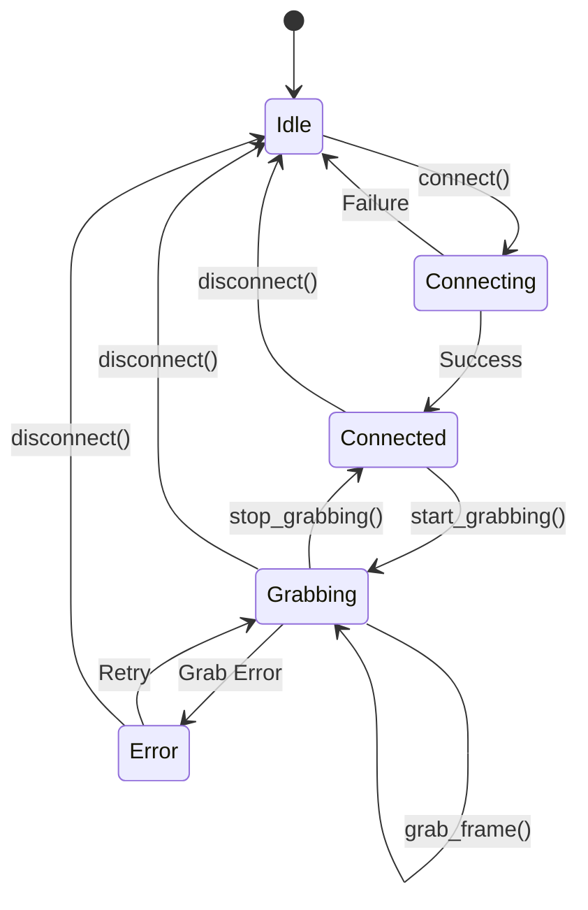
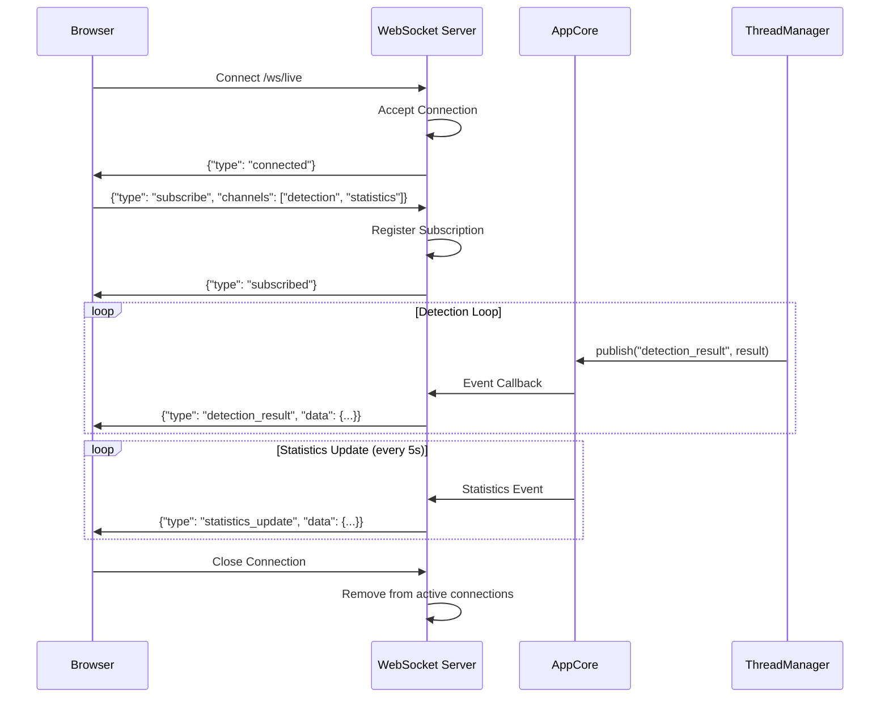
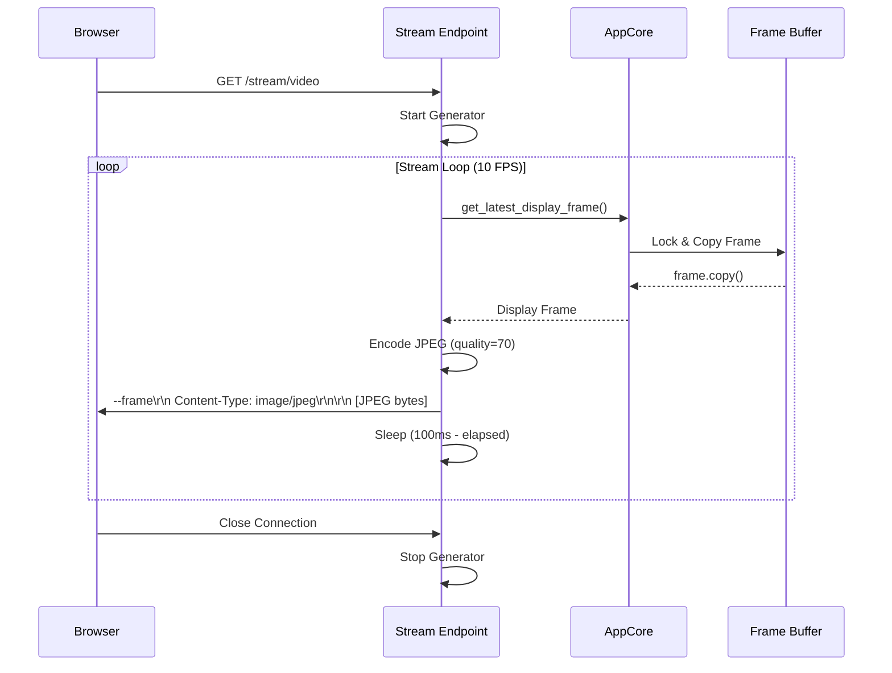

# Architecture Design Document (ARD)
# Hệ Thống Đo Kích Thước Lỗ Tròn - Circle Measurement System

---

## 1. Tổng Quan Kiến Trúc

### 1.1 Mục Đích Tài Liệu

Tài liệu này mô tả chi tiết kiến trúc phần mềm của hệ thống đo kích thước lỗ tròn sử dụng camera Basler và ống kính Telecentric. Tài liệu này dành cho:
- Software Developers
- System Integrators
- Technical Reviewers

### 1.2 Phạm Vi

| Hạng mục | Phạm vi |
|----------|---------|
| Phần mềm | Vision Application trên PC |
| Giao tiếp | GigE Camera, Digital I/O |
| Ngôn ngữ | Python 3.10+ |
| Platform | Windows 10/11 64-bit |

### 1.3 Tài Liệu Tham Chiếu

| Tài liệu | Version |
|----------|---------|
| PRD_Measurement_System.md | 2.0 |
| Basler Pylon SDK Documentation | 7.x |
| OpenCV Documentation | 4.x |

---

## 2. Kiến Trúc Tổng Thể

### 2.1 High-Level Architecture

```
┌─────────────────────────────────────────────────────────────────────────────┐
│                           CIRCLE MEASUREMENT SYSTEM                          │
├─────────────────────────────────────────────────────────────────────────────┤
│                                                                             │
│  ┌─────────────────────────────────────────────────────────────────────┐   │
│  │                      PRESENTATION LAYER                              │   │
│  │  ┌─────────────┐  ┌─────────────┐  ┌─────────────┐  ┌────────────┐  │   │
│  │  │  Main       │  │  Camera     │  │  Settings   │  │  Results   │  │   │
│  │  │  Window     │  │  View       │  │  Panel      │  │  Panel     │  │   │
│  │  └─────────────┘  └─────────────┘  └─────────────┘  └────────────┘  │   │
│  └─────────────────────────────────────────────────────────────────────┘   │
│                                    │                                        │
│                                    ▼                                        │
│  ┌─────────────────────────────────────────────────────────────────────┐   │
│  │                      APPLICATION LAYER                               │   │
│  │  ┌─────────────┐  ┌─────────────┐  ┌─────────────┐  ┌────────────┐  │   │
│  │  │  App        │  │  Detection  │  │  Measure    │  │  Recipe    │  │   │
│  │  │  Controller │  │  Service    │  │  Service    │  │  Manager   │  │   │
│  │  └─────────────┘  └─────────────┘  └─────────────┘  └────────────┘  │   │
│  └─────────────────────────────────────────────────────────────────────┘   │
│                                    │                                        │
│                                    ▼                                        │
│  ┌─────────────────────────────────────────────────────────────────────┐   │
│  │                       DOMAIN LAYER                                   │   │
│  │  ┌─────────────┐  ┌─────────────┐  ┌─────────────┐  ┌────────────┐  │   │
│  │  │  Circle     │  │  Detection  │  │  Calibration│  │  Tolerance │  │   │
│  │  │  Entity     │  │  Config     │  │  Data       │  │  Rule      │  │   │
│  │  └─────────────┘  └─────────────┘  └─────────────┘  └────────────┘  │   │
│  └─────────────────────────────────────────────────────────────────────┘   │
│                                    │                                        │
│                                    ▼                                        │
│  ┌─────────────────────────────────────────────────────────────────────┐   │
│  │                    INFRASTRUCTURE LAYER                              │   │
│  │  ┌─────────────┐  ┌─────────────┐  ┌─────────────┐  ┌────────────┐  │   │
│  │  │  Camera     │  │  Image      │  │  Config     │  │  Logger    │  │   │
│  │  │  Driver     │  │  Processor  │  │  Storage    │  │            │  │   │
│  │  └─────────────┘  └─────────────┘  └─────────────┘  └────────────┘  │   │
│  └─────────────────────────────────────────────────────────────────────┘   │
│                                    │                                        │
│                                    ▼                                        │
│  ┌─────────────────────────────────────────────────────────────────────┐   │
│  │                      EXTERNAL SYSTEMS                                │   │
│  │  ┌─────────────┐  ┌─────────────┐  ┌─────────────┐                  │   │
│  │  │  Basler     │  │  File       │  │  PLC/IO     │                  │   │
│  │  │  Camera     │  │  System     │  │  Interface  │                  │   │
│  │  └─────────────┘  └─────────────┘  └─────────────┘                  │   │
│  └─────────────────────────────────────────────────────────────────────┘   │
│                                                                             │
│  ┌─────────────────────────────────────────────────────────────────────┐   │
│  │                         WEB LAYER (v2.1)                            │   │
│  │  ┌─────────────┐  ┌─────────────┐  ┌─────────────┐  ┌────────────┐  │   │
│  │  │  FastAPI    │  │  WebSocket  │  │  MJPEG      │  │  Static    │  │   │
│  │  │  REST API   │  │  Handler    │  │  Stream     │  │  Files     │  │   │
│  │  └─────────────┘  └─────────────┘  └─────────────┘  └────────────┘  │   │
│  └─────────────────────────────────────────────────────────────────────┘   │
│                                    │                                        │
│                                    ▼                                        │
│  ┌─────────────────────────────────────────────────────────────────────┐   │
│  │                       WEB CLIENTS (Browser)                         │   │
│  │  ┌─────────────┐  ┌─────────────┐  ┌─────────────┐                  │   │
│  │  │  Desktop    │  │  Tablet     │  │  Mobile     │                  │   │
│  │  │  Browser    │  │  Browser    │  │  Browser    │                  │   │
│  │  └─────────────┘  └─────────────┘  └─────────────┘                  │   │
│  └─────────────────────────────────────────────────────────────────────┘   │
│                                                                             │
└─────────────────────────────────────────────────────────────────────────────┘
```

### 2.2 Layer Responsibilities

| Layer | Trách nhiệm | Ví dụ Components |
|-------|-------------|------------------|
| **Presentation** | UI, User interaction | MainWindow, Panels, Dialogs |
| **Application** | Business logic orchestration | Services, Controllers |
| **Domain** | Core business entities & rules | Entities, Value Objects |
| **Infrastructure** | External system communication | Camera driver, File I/O |
| **Web** | Remote monitoring via HTTP | FastAPI, WebSocket, MJPEG |
| **Core** | Shared state & event bus | AppCore, Events |

---

## 3. Component Design

### 3.1 Component Diagram

```
┌──────────────────────────────────────────────────────────────────────┐
│                        GUI Application                                │
│  ┌────────────────────────────────────────────────────────────────┐  │
│  │                     MainWindow                                  │  │
│  │  ┌──────────────┐  ┌──────────────┐  ┌───────────────────────┐ │  │
│  │  │ CameraPanel  │  │ ControlPanel │  │    VideoCanvas        │ │  │
│  │  │ - Connect    │  │ - Exposure   │  │    - Live view        │ │  │
│  │  │ - Disconnect │  │ - Detection  │  │    - Overlay drawing  │ │  │
│  │  │ - Refresh    │  │ - Tolerance  │  │                       │ │  │
│  │  └──────┬───────┘  └──────┬───────┘  └───────────┬───────────┘ │  │
│  └─────────┼─────────────────┼──────────────────────┼─────────────┘  │
│            │                 │                      │                │
│            ▼                 ▼                      ▼                │
│  ┌─────────────────────────────────────────────────────────────────┐ │
│  │                    ApplicationController                         │ │
│  │  - Coordinates all services                                      │ │
│  │  - Manages application state                                     │ │
│  │  - Handles user commands                                         │ │
│  └──────────────────────────┬──────────────────────────────────────┘ │
│                             │                                        │
│         ┌───────────────────┼───────────────────┐                   │
│         ▼                   ▼                   ▼                   │
│  ┌─────────────┐     ┌─────────────┐     ┌─────────────┐            │
│  │CameraService│     │CircleDetector│    │Visualizer   │            │
│  │- connect()  │     │- detect()   │     │- draw()     │            │
│  │- disconnect()│    │- configure()│     │- overlay()  │            │
│  │- grab()     │     │             │     │             │            │
│  └──────┬──────┘     └──────┬──────┘     └─────────────┘            │
│         │                   │                                        │
│         ▼                   ▼                                        │
│  ┌─────────────┐     ┌─────────────┐                                │
│  │BaslerDriver │     │ImageProcessor                                │
│  │(pypylon)    │     │(OpenCV)     │                                │
│  └─────────────┘     └─────────────┘                                │
└──────────────────────────────────────────────────────────────────────┘
```

### 3.2 Component Descriptions

#### 3.2.1 CameraService
```
Responsibilities:
  - Quản lý kết nối camera GigE
  - Cấu hình camera (exposure, trigger, etc.)
  - Grab và trả về frame

Dependencies:
  - pypylon (Basler Pylon SDK)

Interface:
  + list_devices() → List[DeviceInfo]
  + connect(device_index, exposure_us) → bool
  + disconnect() → void
  + grab_frame() → ndarray
  + set_exposure(exposure_us) → void
  + is_connected → bool
```

#### 3.2.2 CircleDetector
```
Responsibilities:
  - Xử lý ảnh (pre-processing)
  - Phát hiện hình tròn tự động
  - Tính toán thông số (diameter, circularity)

Dependencies:
  - OpenCV
  - NumPy

Interface:
  + detect(frame) → Tuple[List[CircleResult], binary_image]
  + configure(config: DetectionConfig) → void
```

#### 3.2.3 Visualizer
```
Responsibilities:
  - Vẽ overlay lên frame (edge, diameter line, label)
  - Hiển thị kết quả OK/NG

Dependencies:
  - OpenCV

Interface:
  + draw(frame, circles, tolerance) → frame_with_overlay
```

#### 3.2.4 ApplicationController
```
Responsibilities:
  - Điều phối các services
  - Quản lý application state
  - Xử lý user commands

Dependencies:
  - CameraService
  - CircleDetector
  - Visualizer

Interface:
  + start() → void
  + stop() → void
  + on_connect() → void
  + on_disconnect() → void
  + update_settings(config) → void
```

---

## 4. Class Design

### 4.1 Class Diagram

```
┌─────────────────────────────────────────────────────────────────────────────┐
│                              Domain Classes                                  │
├─────────────────────────────────────────────────────────────────────────────┤
│                                                                             │
│  ┌─────────────────────┐         ┌─────────────────────┐                   │
│  │   <<dataclass>>     │         │   <<dataclass>>     │                   │
│  │   CircleResult      │         │   DetectionConfig   │                   │
│  ├─────────────────────┤         ├─────────────────────┤                   │
│  │ + hole_id: int      │         │ + pixel_to_mm: float│                   │
│  │ + center_x: float   │         │ + min_diameter: float                   │
│  │ + center_y: float   │         │ + max_diameter: float                   │
│  │ + radius: float     │         │ + min_circularity: float                │
│  │ + diameter_mm: float│         │ + blur_kernel: int  │                   │
│  │ + circularity: float│         │ + edge_margin: int  │                   │
│  │ + area_mm2: float   │         │ + show_contours: bool                   │
│  │ + status: Status    │         │ + show_diameter: bool                   │
│  └─────────────────────┘         │ + show_label: bool  │                   │
│                                  └─────────────────────┘                   │
│                                                                             │
│  ┌─────────────────────┐         ┌─────────────────────┐                   │
│  │   <<dataclass>>     │         │    <<enum>>         │                   │
│  │   ToleranceConfig   │         │    MeasureStatus    │                   │
│  ├─────────────────────┤         ├─────────────────────┤                   │
│  │ + enabled: bool     │         │ OK                  │                   │
│  │ + nominal_mm: float │         │ NG                  │                   │
│  │ + tolerance_mm: float         │ PARTIAL             │                   │
│  └─────────────────────┘         │ SKIPPED             │                   │
│                                  └─────────────────────┘                   │
│                                                                             │
│  ┌─────────────────────┐         ┌─────────────────────┐                   │
│  │   <<dataclass>>     │         │   <<dataclass>>     │                   │
│  │   CalibrationData   │         │   Recipe            │                   │
│  ├─────────────────────┤         ├─────────────────────┤                   │
│  │ + pixel_to_mm: float│         │ + name: str         │                   │
│  │ + calibrated_at:    │         │ + detection_config  │                   │
│  │     datetime        │         │ + tolerance_config  │                   │
│  │ + reference_size:   │         │ + calibration_data  │                   │
│  │     float           │         │ + created_at: datetime                  │
│  └─────────────────────┘         └─────────────────────┘                   │
│                                                                             │
└─────────────────────────────────────────────────────────────────────────────┘

┌─────────────────────────────────────────────────────────────────────────────┐
│                              Service Classes                                 │
├─────────────────────────────────────────────────────────────────────────────┤
│                                                                             │
│  ┌─────────────────────────────────────────────────────────────────────┐   │
│  │                        BaslerGigECamera                              │   │
│  ├─────────────────────────────────────────────────────────────────────┤   │
│  │ - camera: pylon.InstantCamera                                        │   │
│  │ - converter: pylon.ImageFormatConverter                              │   │
│  │ - is_connected: bool                                                 │   │
│  │ - is_grabbing: bool                                                  │   │
│  │ - device_info: DeviceInfo                                            │   │
│  ├─────────────────────────────────────────────────────────────────────┤   │
│  │ + list_devices() → List[Dict]                                        │   │
│  │ + connect(device_index: int, exposure_us: float) → bool              │   │
│  │ + disconnect() → void                                                │   │
│  │ + start_grabbing() → void                                            │   │
│  │ + stop_grabbing() → void                                             │   │
│  │ + grab_frame() → Optional[ndarray]                                   │   │
│  │ + set_exposure(exposure_us: float) → void                            │   │
│  │ + get_info() → Dict                                                  │   │
│  └─────────────────────────────────────────────────────────────────────┘   │
│                                                                             │
│  ┌─────────────────────────────────────────────────────────────────────┐   │
│  │                         CircleDetector                               │   │
│  ├─────────────────────────────────────────────────────────────────────┤   │
│  │ - config: DetectionConfig                                            │   │
│  │ - min_area_px: float                                                 │   │
│  │ - max_area_px: float                                                 │   │
│  ├─────────────────────────────────────────────────────────────────────┤   │
│  │ + __init__(config: DetectionConfig)                                  │   │
│  │ + detect(frame: ndarray) → Tuple[List[CircleResult], ndarray]        │   │
│  │ + update_config(config: DetectionConfig) → void                      │   │
│  │ - _calc_pixel_limits() → void                                        │   │
│  │ - _preprocess(frame: ndarray) → ndarray                              │   │
│  │ - _find_circles(binary: ndarray) → List[CircleResult]                │   │
│  └─────────────────────────────────────────────────────────────────────┘   │
│                                                                             │
│  ┌─────────────────────────────────────────────────────────────────────┐   │
│  │                        CircleVisualizer                              │   │
│  ├─────────────────────────────────────────────────────────────────────┤   │
│  │ - config: DetectionConfig                                            │   │
│  │ - colors: Dict[str, Tuple]                                           │   │
│  ├─────────────────────────────────────────────────────────────────────┤   │
│  │ + draw(frame: ndarray, circles: List[CircleResult],                  │   │
│  │        tolerance: Optional[ToleranceConfig]) → ndarray               │   │
│  │ - _draw_circle_edge(frame, circle, color) → void                     │   │
│  │ - _draw_diameter_line(frame, circle) → void                          │   │
│  │ - _draw_label(frame, circle, tolerance) → void                       │   │
│  └─────────────────────────────────────────────────────────────────────┘   │
│                                                                             │
└─────────────────────────────────────────────────────────────────────────────┘
```

### 4.2 Data Flow Diagram

```
┌─────────────────────────────────────────────────────────────────────────────┐
│                            DATA FLOW DIAGRAM                                 │
├─────────────────────────────────────────────────────────────────────────────┤
│                                                                             │
│  ┌─────────┐      ┌─────────────┐      ┌─────────────┐      ┌──────────┐   │
│  │ Camera  │─────>│ Raw Frame   │─────>│ Grayscale   │─────>│ Blurred  │   │
│  │ (GigE)  │      │ (BGR)       │      │ Frame       │      │ Frame    │   │
│  └─────────┘      └─────────────┘      └─────────────┘      └────┬─────┘   │
│                                                                   │         │
│                                                                   ▼         │
│  ┌──────────────────────────────────────────────────────────────────────┐  │
│  │                         Binary Threshold                              │  │
│  │                    (Otsu's Method / Adaptive)                         │  │
│  └────────────────────────────────┬─────────────────────────────────────┘  │
│                                   │                                        │
│                                   ▼                                        │
│  ┌──────────────────────────────────────────────────────────────────────┐  │
│  │                       Find Contours                                   │  │
│  │                  List of all closed contours                          │  │
│  └────────────────────────────────┬─────────────────────────────────────┘  │
│                                   │                                        │
│                                   ▼                                        │
│  ┌──────────────────────────────────────────────────────────────────────┐  │
│  │                      Filter Contours                                  │  │
│  │  ┌────────────────┐  ┌────────────────┐  ┌────────────────┐          │  │
│  │  │ Area Filter    │  │ Circularity    │  │ Edge Margin    │          │  │
│  │  │ min < A < max  │  │ > 0.85         │  │ Check          │          │  │
│  │  └────────────────┘  └────────────────┘  └────────────────┘          │  │
│  └────────────────────────────────┬─────────────────────────────────────┘  │
│                                   │                                        │
│                                   ▼                                        │
│  ┌──────────────────────────────────────────────────────────────────────┐  │
│  │                     Fit Circle (Each Contour)                         │  │
│  │              cv2.minEnclosingCircle() → (center, radius)              │  │
│  └────────────────────────────────┬─────────────────────────────────────┘  │
│                                   │                                        │
│                                   ▼                                        │
│  ┌──────────────────────────────────────────────────────────────────────┐  │
│  │                      Calculate Measurements                           │  │
│  │  ┌────────────────┐  ┌────────────────┐  ┌────────────────┐          │  │
│  │  │ Diameter (mm)  │  │ Area (mm²)     │  │ Circularity    │          │  │
│  │  │ = 2r × px2mm   │  │ = A × px2mm²   │  │ = 4πA/P²       │          │  │
│  │  └────────────────┘  └────────────────┘  └────────────────┘          │  │
│  └────────────────────────────────┬─────────────────────────────────────┘  │
│                                   │                                        │
│                                   ▼                                        │
│  ┌────────────────┐      ┌────────────────┐      ┌────────────────┐       │
│  │ CircleResult   │─────>│ Tolerance      │─────>│ Status         │       │
│  │ List           │      │ Check          │      │ (OK/NG)        │       │
│  └────────────────┘      └────────────────┘      └───────┬────────┘       │
│                                                          │                 │
│                          ┌───────────────────────────────┘                 │
│                          │                                                 │
│                          ▼                                                 │
│  ┌──────────────────────────────────────────────────────────────────────┐  │
│  │                         Visualizer                                    │  │
│  │  ┌────────────────┐  ┌────────────────┐  ┌────────────────┐          │  │
│  │  │ Draw Edge      │  │ Draw Diameter  │  │ Draw Label     │          │  │
│  │  │ (Green/Red)    │  │ Line (Blue)    │  │ D=xx.xxxmm     │          │  │
│  │  └────────────────┘  └────────────────┘  └────────────────┘          │  │
│  └────────────────────────────────┬─────────────────────────────────────┘  │
│                                   │                                        │
│                                   ▼                                        │
│                          ┌────────────────┐                                │
│                          │ Display Frame  │                                │
│                          │ (with Overlay) │                                │
│                          └────────────────┘                                │
│                                                                             │
└─────────────────────────────────────────────────────────────────────────────┘
```

---

## 5. Module Structure

### 5.1 Project Structure

```
circle_measurement_system/
│
├── src/
│   ├── __init__.py
│   │
│   ├── main.py                      # Entry point
│   │
│   ├── domain/                      # Domain entities
│   │   ├── __init__.py
│   │   ├── entities.py              # CircleResult, Recipe, etc.
│   │   ├── enums.py                 # MeasureStatus, etc.
│   │   └── config.py                # DetectionConfig, ToleranceConfig
│   │
│   ├── services/                    # Business logic
│   │   ├── __init__.py
│   │   ├── camera_service.py        # BaslerGigECamera
│   │   ├── detector_service.py      # CircleDetector
│   │   ├── visualizer_service.py    # CircleVisualizer
│   │   ├── calibration_service.py   # CalibrationManager
│   │   └── recipe_service.py        # RecipeManager
│   │
│   ├── ui/                          # User interface
│   │   ├── __init__.py
│   │   ├── main_window.py           # Main application window
│   │   ├── panels/
│   │   │   ├── __init__.py
│   │   │   ├── camera_panel.py      # Camera connection panel
│   │   │   ├── control_panel.py     # Settings panel
│   │   │   ├── results_panel.py     # Detection results
│   │   │   └── video_canvas.py      # Video display
│   │   └── dialogs/
│   │       ├── __init__.py
│   │       ├── calibration_dialog.py
│   │       └── recipe_dialog.py
│   │
│   ├── infrastructure/              # External interfaces
│   │   ├── __init__.py
│   │   ├── basler_driver.py         # Pylon SDK wrapper
│   │   ├── image_processor.py       # OpenCV operations
│   │   ├── config_storage.py        # JSON/YAML config files
│   │   └── logger.py                # Logging setup
│   │
│   └── utils/                       # Utilities
│       ├── __init__.py
│       ├── constants.py             # Application constants
│       └── helpers.py               # Helper functions
│
├── config/
│   ├── default_config.json          # Default settings
│   └── recipes/                     # Recipe files
│       └── sample_recipe.json
│
├── logs/                            # Log files
│
├── tests/                           # Unit tests
│   ├── __init__.py
│   ├── test_detector.py
│   ├── test_camera.py
│   └── test_visualizer.py
│
├── docs/                            # Documentation
│   ├── PRD_Measurement_System.md
│   └── ARD_Architecture_Design.md
│
├── requirements.txt
├── setup.py
└── README.md
```

### 5.2 Module Dependencies

```
┌─────────────────────────────────────────────────────────────────────────────┐
│                          MODULE DEPENDENCY GRAPH                             │
├─────────────────────────────────────────────────────────────────────────────┤
│                                                                             │
│                              ┌──────────┐                                   │
│                              │  main.py │                                   │
│                              └────┬─────┘                                   │
│                                   │                                         │
│                                   ▼                                         │
│                         ┌─────────────────┐                                 │
│                         │  main_window.py │                                 │
│                         └────────┬────────┘                                 │
│                                  │                                          │
│           ┌──────────────────────┼──────────────────────┐                  │
│           │                      │                      │                  │
│           ▼                      ▼                      ▼                  │
│  ┌─────────────────┐   ┌─────────────────┐   ┌─────────────────┐          │
│  │  camera_panel   │   │  control_panel  │   │  video_canvas   │          │
│  └────────┬────────┘   └────────┬────────┘   └────────┬────────┘          │
│           │                     │                     │                    │
│           └──────────────┬──────┴─────────────────────┘                    │
│                          │                                                  │
│                          ▼                                                  │
│  ┌───────────────────────────────────────────────────────────────────────┐ │
│  │                         SERVICES LAYER                                 │ │
│  │  ┌──────────────┐  ┌──────────────┐  ┌──────────────┐  ┌───────────┐  │ │
│  │  │camera_service│  │detector_     │  │visualizer_   │  │calibration│  │ │
│  │  │              │  │service       │  │service       │  │_service   │  │ │
│  │  └──────┬───────┘  └──────┬───────┘  └──────┬───────┘  └─────┬─────┘  │ │
│  └─────────┼─────────────────┼─────────────────┼────────────────┼────────┘ │
│            │                 │                 │                │          │
│            ▼                 ▼                 ▼                ▼          │
│  ┌───────────────────────────────────────────────────────────────────────┐ │
│  │                        DOMAIN LAYER                                    │ │
│  │  ┌──────────────┐  ┌──────────────┐  ┌──────────────┐                  │ │
│  │  │  entities    │  │   config     │  │    enums     │                  │ │
│  │  └──────────────┘  └──────────────┘  └──────────────┘                  │ │
│  └───────────────────────────────────────────────────────────────────────┘ │
│            │                 │                                              │
│            ▼                 ▼                                              │
│  ┌───────────────────────────────────────────────────────────────────────┐ │
│  │                     INFRASTRUCTURE LAYER                               │ │
│  │  ┌──────────────┐  ┌──────────────┐  ┌──────────────┐                  │ │
│  │  │basler_driver │  │image_processor│ │config_storage│                  │ │
│  │  │  (pypylon)   │  │  (OpenCV)    │  │  (JSON)      │                  │ │
│  │  └──────────────┘  └──────────────┘  └──────────────┘                  │ │
│  └───────────────────────────────────────────────────────────────────────┘ │
│                                                                             │
└─────────────────────────────────────────────────────────────────────────────┘
```

---

## 6. Interface Design

### 6.1 Camera Service Interface

```python
class ICameraService(Protocol):
    """Interface for camera operations"""

    @staticmethod
    def list_devices() -> List[Dict[str, Any]]:
        """List all available camera devices"""
        ...

    def connect(self, device_index: int, exposure_us: float = 50.0) -> bool:
        """Connect to camera by index"""
        ...

    def disconnect(self) -> None:
        """Disconnect from camera"""
        ...

    def grab_frame(self) -> Optional[np.ndarray]:
        """Grab a single frame"""
        ...

    def set_exposure(self, exposure_us: float) -> None:
        """Set exposure time in microseconds"""
        ...

    @property
    def is_connected(self) -> bool:
        """Check if camera is connected"""
        ...
```

### 6.2 Detector Service Interface

```python
class IDetectorService(Protocol):
    """Interface for circle detection"""

    def detect(self, frame: np.ndarray) -> Tuple[List[CircleResult], np.ndarray]:
        """
        Detect circles in frame
        Returns: (list of circles, binary image)
        """
        ...

    def configure(self, config: DetectionConfig) -> None:
        """Update detection configuration"""
        ...
```

### 6.3 Visualizer Service Interface

```python
class IVisualizerService(Protocol):
    """Interface for visualization"""

    def draw(
        self,
        frame: np.ndarray,
        circles: List[CircleResult],
        tolerance: Optional[ToleranceConfig] = None
    ) -> np.ndarray:
        """Draw detection results on frame"""
        ...
```

### 6.4 PLC/IO Interface

#### 6.4.1 Interface Specification

```
┌─────────────────────────────────────────────────────────────────────────────┐
│                           PLC/IO INTERFACE                                   │
├─────────────────────────────────────────────────────────────────────────────┤
│                                                                             │
│  ┌─────────────────┐         ┌─────────────────┐         ┌──────────────┐  │
│  │   Vision PC     │◄───────►│   I/O Card      │◄───────►│     PLC      │  │
│  │                 │  API    │  (NI/Advantech) │  24V DC │              │  │
│  └─────────────────┘         └─────────────────┘         └──────────────┘  │
│                                                                             │
│  Digital Inputs (từ PLC):                                                   │
│  ┌─────────┬───────────────────────────────────────────────────────────┐   │
│  │ DI-0    │ Trigger Signal (Rising Edge) - Vật đến vùng kiểm tra      │   │
│  │ DI-1    │ System Enable - PLC cho phép hệ thống hoạt động           │   │
│  │ DI-2    │ Recipe Select Bit 0                                        │   │
│  │ DI-3    │ Recipe Select Bit 1                                        │   │
│  └─────────┴───────────────────────────────────────────────────────────┘   │
│                                                                             │
│  Digital Outputs (đến PLC):                                                 │
│  ┌─────────┬───────────────────────────────────────────────────────────┐   │
│  │ DO-0    │ Result OK - Sản phẩm đạt yêu cầu                          │   │
│  │ DO-1    │ Result NG - Sản phẩm không đạt                            │   │
│  │ DO-2    │ System Ready - Hệ thống sẵn sàng nhận trigger             │   │
│  │ DO-3    │ System Error - Có lỗi hệ thống                            │   │
│  │ DO-4    │ Busy - Đang xử lý                                          │   │
│  └─────────┴───────────────────────────────────────────────────────────┘   │
│                                                                             │
└─────────────────────────────────────────────────────────────────────────────┘
```

#### 6.4.2 IO Service Interface

```python
class IIOService(Protocol):
    """Interface for PLC/IO communication"""

    def initialize(self, config: IOConfig) -> bool:
        """Initialize I/O card connection"""
        ...

    def read_input(self, channel: int) -> bool:
        """Read digital input state"""
        ...

    def write_output(self, channel: int, state: bool) -> None:
        """Write digital output state"""
        ...

    def set_result(self, ok: bool) -> None:
        """Set OK/NG result outputs"""
        ...

    def set_ready(self, ready: bool) -> None:
        """Set system ready signal"""
        ...

    def set_error(self, error: bool) -> None:
        """Set system error signal"""
        ...

    def register_trigger_callback(self, callback: Callable) -> None:
        """Register callback for trigger signal"""
        ...

    def cleanup(self) -> None:
        """Release I/O resources"""
        ...
```

#### 6.4.3 IO Configuration

```python
@dataclass
class IOConfig:
    """I/O card configuration"""
    device_name: str = "Dev1"          # NI-DAQmx device name
    trigger_channel: int = 0           # DI channel for trigger
    enable_channel: int = 1            # DI channel for system enable
    ok_channel: int = 0                # DO channel for OK signal
    ng_channel: int = 1                # DO channel for NG signal
    ready_channel: int = 2             # DO channel for ready signal
    error_channel: int = 3             # DO channel for error signal
    busy_channel: int = 4              # DO channel for busy signal
    trigger_debounce_ms: int = 10      # Trigger debounce time
    result_pulse_ms: int = 100         # OK/NG pulse duration
```

#### 6.4.4 Timing Diagram

```
Trigger ─────┐     ┌─────────────────────────────────────────────────
(DI-0)       └─────┘
             │
             │<─── Rising Edge Detection
             │
Busy    ─────┴─────────────────────────┬───────────────────────────────
(DO-4)                                 │
                                       │<─── Processing Complete
                                       │
Ready   ─────┬─────────────────────────┴───────────────────────────────
(DO-2)       │
             │<─── System processes image
             │
OK/NG   ─────────────────────────────────┐     ┌───────────────────────
(DO-0/1)                                 └─────┘
                                         │<───>│ Pulse 100ms

Timeline: |<── Grab ──>|<── Process ──>|<── Output ──>|
           ~30ms         ~100ms          ~100ms
```

---

## 7. Configuration Management

### 7.1 Configuration Schema

```json
{
  "$schema": "http://json-schema.org/draft-07/schema#",
  "title": "Application Configuration",
  "type": "object",
  "properties": {
    "camera": {
      "type": "object",
      "properties": {
        "default_exposure_us": {"type": "number", "default": 50.0},
        "trigger_mode": {"type": "string", "enum": ["software", "hardware"]},
        "pixel_format": {"type": "string", "default": "BGR8"}
      }
    },
    "detection": {
      "type": "object",
      "properties": {
        "pixel_to_mm": {"type": "number", "default": 0.00644},
        "min_diameter_mm": {"type": "number", "default": 1.0},
        "max_diameter_mm": {"type": "number", "default": 20.0},
        "min_circularity": {"type": "number", "default": 0.85},
        "blur_kernel": {"type": "integer", "default": 5},
        "edge_margin": {"type": "integer", "default": 10}
      }
    },
    "tolerance": {
      "type": "object",
      "properties": {
        "enabled": {"type": "boolean", "default": false},
        "nominal_mm": {"type": "number", "default": 10.0},
        "tolerance_mm": {"type": "number", "default": 0.05}
      }
    },
    "display": {
      "type": "object",
      "properties": {
        "show_contours": {"type": "boolean", "default": true},
        "show_diameter_line": {"type": "boolean", "default": true},
        "show_labels": {"type": "boolean", "default": true}
      }
    }
  }
}
```

### 7.2 Recipe Schema

```json
{
  "name": "Product_A_10mm_Holes",
  "version": "1.0",
  "created_at": "2025-12-26T10:00:00Z",
  "detection": {
    "min_diameter_mm": 8.0,
    "max_diameter_mm": 12.0,
    "min_circularity": 0.90
  },
  "tolerance": {
    "enabled": true,
    "nominal_mm": 10.0,
    "tolerance_mm": 0.05
  },
  "calibration": {
    "pixel_to_mm": 0.00644,
    "calibrated_at": "2025-12-26T09:00:00Z"
  }
}
```

---

## 8. Error Handling Strategy

### 8.1 Exception Hierarchy

```
BaseApplicationError
├── CameraError
│   ├── CameraNotFoundError
│   ├── CameraConnectionError
│   └── CameraGrabError
├── DetectionError
│   ├── InvalidImageError
│   └── ProcessingError
├── ConfigurationError
│   ├── InvalidConfigError
│   └── ConfigNotFoundError
└── CalibrationError
    └── InvalidCalibrationError
```

### 8.2 Error Handling Matrix

| Error Type | Severity | User Action | System Action |
|------------|----------|-------------|---------------|
| CameraNotFound | High | Check connection | Show dialog, retry option |
| CameraGrabError | Medium | - | Retry grab, log warning |
| InvalidImage | Low | - | Skip frame, log |
| ConfigNotFound | Medium | Select config | Use defaults |
| CalibrationInvalid | High | Re-calibrate | Block measurement |

---

## 9. Performance Considerations

### 9.1 Performance Requirements

| Metric | Requirement | Target |
|--------|-------------|--------|
| Frame processing time | < 200ms | < 100ms |
| UI responsiveness | < 100ms | < 50ms |
| Memory usage | < 500MB | < 300MB |
| Camera latency | < 50ms | < 30ms |

### 9.2 Optimization Strategies

1. **Image Processing**
   - Sử dụng ROI để giảm vùng xử lý
   - Resize ảnh trước khi hiển thị
   - Sử dụng NumPy vectorized operations

2. **Threading**
   - Camera grab thread riêng
   - UI thread không bị block
   - Processing có thể parallel

3. **Memory Management**
   - Reuse frame buffers
   - Clear old frames kịp thời
   - Limit history/log size

### 9.3 Threading Model

#### 9.3.1 Thread Architecture

```
┌─────────────────────────────────────────────────────────────────────────────┐
│                           THREADING MODEL                                    │
├─────────────────────────────────────────────────────────────────────────────┤
│                                                                             │
│  ┌───────────────────────────────────────────────────────────────────────┐  │
│  │                         MAIN THREAD (UI)                               │  │
│  │  - Tkinter mainloop                                                    │  │
│  │  - User interaction handling                                           │  │
│  │  - Display updates (via queue)                                         │  │
│  └───────────────────────────────────────────────────────────────────────┘  │
│           │                           ▲                                     │
│           │ Commands                  │ Results (Queue)                     │
│           ▼                           │                                     │
│  ┌───────────────────────────────────────────────────────────────────────┐  │
│  │                      CAMERA THREAD (Daemon)                            │  │
│  │  - Frame grabbing loop                                                 │  │
│  │  - Frame buffer management                                             │  │
│  │  - Puts frames to processing queue                                     │  │
│  └───────────────────────────────────────────────────────────────────────┘  │
│           │                                                                 │
│           │ Frames (Queue)                                                  │
│           ▼                                                                 │
│  ┌───────────────────────────────────────────────────────────────────────┐  │
│  │                     PROCESSING THREAD (Daemon)                         │  │
│  │  - Circle detection                                                    │  │
│  │  - Measurement calculation                                             │  │
│  │  - Tolerance checking                                                  │  │
│  │  - Puts results to display queue                                       │  │
│  └───────────────────────────────────────────────────────────────────────┘  │
│           │                                                                 │
│           │ Results                                                         │
│           ▼                                                                 │
│  ┌───────────────────────────────────────────────────────────────────────┐  │
│  │                        IO THREAD (Daemon)                              │  │
│  │  - Trigger signal monitoring                                           │  │
│  │  - Output signal control                                               │  │
│  │  - PLC communication                                                   │  │
│  └───────────────────────────────────────────────────────────────────────┘  │
│                                                                             │
└─────────────────────────────────────────────────────────────────────────────┘
```

#### 9.3.2 Thread Communication

```python
# Queue definitions
frame_queue: Queue[np.ndarray]       # Camera → Processing (maxsize=2)
result_queue: Queue[ProcessResult]   # Processing → UI (maxsize=5)
io_command_queue: Queue[IOCommand]   # Processing → IO (maxsize=10)

# Thread-safe events
stop_event: threading.Event          # Signal to stop all threads
camera_ready: threading.Event        # Camera connected and ready
trigger_event: threading.Event       # External trigger received
```

#### 9.3.3 Thread Lifecycle

```python
class ThreadManager:
    """Manages application threads"""

    def __init__(self):
        self.camera_thread: Optional[threading.Thread] = None
        self.processing_thread: Optional[threading.Thread] = None
        self.io_thread: Optional[threading.Thread] = None
        self.stop_event = threading.Event()

    def start_threads(self) -> None:
        """Start all worker threads"""
        self.stop_event.clear()

        self.camera_thread = threading.Thread(
            target=self._camera_loop,
            daemon=True,
            name="CameraThread"
        )

        self.processing_thread = threading.Thread(
            target=self._processing_loop,
            daemon=True,
            name="ProcessingThread"
        )

        self.io_thread = threading.Thread(
            target=self._io_loop,
            daemon=True,
            name="IOThread"
        )

        self.camera_thread.start()
        self.processing_thread.start()
        self.io_thread.start()

    def stop_threads(self) -> None:
        """Stop all worker threads gracefully"""
        self.stop_event.set()

        # Wait for threads to finish (with timeout)
        if self.camera_thread:
            self.camera_thread.join(timeout=2.0)
        if self.processing_thread:
            self.processing_thread.join(timeout=2.0)
        if self.io_thread:
            self.io_thread.join(timeout=2.0)

    def _camera_loop(self) -> None:
        """Camera grab loop"""
        while not self.stop_event.is_set():
            frame = self.camera.grab_frame()
            if frame is not None:
                try:
                    self.frame_queue.put(frame, timeout=0.1)
                except Full:
                    pass  # Drop frame if queue is full

    def _processing_loop(self) -> None:
        """Image processing loop"""
        while not self.stop_event.is_set():
            try:
                frame = self.frame_queue.get(timeout=0.1)
                result = self.detector.detect(frame)
                self.result_queue.put(result, timeout=0.1)
            except Empty:
                continue

    def _io_loop(self) -> None:
        """I/O monitoring loop"""
        while not self.stop_event.is_set():
            # Monitor trigger input
            if self.io_service.check_trigger():
                self.trigger_event.set()

            # Process output commands
            try:
                cmd = self.io_command_queue.get(timeout=0.01)
                self.io_service.execute(cmd)
            except Empty:
                continue
```

#### 9.3.4 Thread Safety Considerations

| Resource | Protection Mechanism | Notes |
|----------|---------------------|-------|
| Camera object | Single thread access | Only camera thread accesses |
| Configuration | RLock | Read often, write rarely |
| Frame buffers | Queue | Thread-safe handoff |
| UI widgets | Queue + after() | Tkinter requires main thread |
| I/O card | Single thread access | Only IO thread accesses |
| Log file | Logging module | Built-in thread safety |

#### 9.3.5 Synchronization Patterns

```python
# Pattern 1: Producer-Consumer (Camera → Processing)
def camera_producer():
    while running:
        frame = camera.grab()
        frame_queue.put(frame)  # Blocks if full

def processing_consumer():
    while running:
        frame = frame_queue.get()  # Blocks if empty
        result = process(frame)

# Pattern 2: Event-based Trigger
def wait_for_trigger():
    trigger_event.wait(timeout=1.0)
    if trigger_event.is_set():
        trigger_event.clear()
        return True
    return False

# Pattern 3: UI Update from Worker Thread
def update_ui_safely(widget, data):
    # Schedule update on main thread
    widget.after(0, lambda: widget.update(data))
```

---

## 10. Testing Strategy

### 10.1 Test Levels

| Level | Scope | Tools |
|-------|-------|-------|
| Unit Test | Individual classes | pytest |
| Integration Test | Service interactions | pytest |
| System Test | Full application | Manual + Automated |
| Performance Test | Speed, memory | pytest-benchmark |

### 10.2 Test Coverage Targets

| Module | Coverage Target |
|--------|-----------------|
| Domain | 95% |
| Services | 90% |
| Infrastructure | 80% |
| UI | 70% |

---

## 11. Deployment

### 11.1 System Requirements

| Component | Minimum | Recommended |
|-----------|---------|-------------|
| OS | Windows 10 64-bit | Windows 11 64-bit |
| CPU | Intel i5 | Intel i7 |
| RAM | 8 GB | 16 GB |
| Storage | 10 GB free | 50 GB SSD |
| Network | GigE port | Dedicated GigE |
| Display | 1920×1080 | 1920×1080 |

### 11.2 Dependencies

```
# Python 3.10+
numpy>=1.21.0
opencv-python>=4.5.0
Pillow>=9.0.0
pypylon>=1.9.0

# Development
pytest>=7.0.0
pytest-cov>=3.0.0
black>=22.0.0
mypy>=0.950
```

### 11.3 Installation Steps

```bash
# 1. Install Basler Pylon SDK
# Download from: https://www.baslerweb.com/en/downloads/software-downloads/

# 2. Create virtual environment
python -m venv venv
venv\Scripts\activate

# 3. Install dependencies
pip install -r requirements.txt

# 4. Run application
python src/main.py
```

---

## 12. Sequence Diagrams (Mermaid)

### 12.1 Calibration Flow



### 12.2 Recipe Loading Flow



### 12.3 Trigger → Detection → Output Flow



---

## 13. State Machine Diagrams

### 13.1 IO State Machine



### 13.2 Camera State Machine



---

## 14. Deployment Diagram

```
┌─────────────────────────────────────────────────────────────────────────────┐
│                           PRODUCTION ENVIRONMENT                              │
├─────────────────────────────────────────────────────────────────────────────┤
│                                                                             │
│  ┌─────────────────────────────────────────────────────────────────────┐   │
│  │                        Factory Network                               │   │
│  │                       (192.168.1.0/24)                               │   │
│  └───────────────────────────────┬─────────────────────────────────────┘   │
│                                  │                                          │
│          ┌───────────────────────┼───────────────────────┐                 │
│          │                       │                       │                 │
│          ▼                       ▼                       ▼                 │
│  ┌───────────────┐      ┌───────────────┐      ┌───────────────┐          │
│  │  Vision PC    │      │    PLC        │      │    SCADA      │          │
│  │ 192.168.1.10  │      │ 192.168.1.20  │      │ 192.168.1.30  │          │
│  ├───────────────┤      ├───────────────┤      ├───────────────┤          │
│  │ Windows 11    │      │ Siemens S7    │      │ WinCC         │          │
│  │ Python 3.11   │      │ 1214C         │      │ Server        │          │
│  │ Circle App    │      │               │      │               │          │
│  └───────┬───────┘      └───────┬───────┘      └───────────────┘          │
│          │                      │                                          │
│          │ GigE (192.168.2.x)   │ Digital I/O                              │
│          │                      │ (24V DC)                                  │
│          ▼                      │                                          │
│  ┌───────────────┐              │                                          │
│  │ Basler Camera │              │                                          │
│  │ 192.168.2.10  │              │                                          │
│  ├───────────────┤              │                                          │
│  │ acA4600-7gc   │              │                                          │
│  │ + Telecentric │              │                                          │
│  └───────┬───────┘              │                                          │
│          │                      │                                          │
│          ▼                      ▼                                          │
│  ┌─────────────────────────────────────────────────────────────────────┐   │
│  │                        CONVEYOR SYSTEM                               │   │
│  │  ┌─────────┐  ┌─────────┐  ┌─────────┐  ┌─────────┐  ┌─────────┐   │   │
│  │  │ Part In │→ │ Sensor  │→ │ Camera  │→ │ Vision  │→ │ Part Out│   │   │
│  │  │         │  │ (Trigger)│  │ (FOV)   │  │ (LED)   │  │ (OK/NG) │   │   │
│  │  └─────────┘  └─────────┘  └─────────┘  └─────────┘  └─────────┘   │   │
│  └─────────────────────────────────────────────────────────────────────┘   │
│                                                                             │
└─────────────────────────────────────────────────────────────────────────────┘

Network Configuration:
┌─────────────────────────────────────────────────────────────────────────────┐
│ Vision PC Network Interfaces:                                                │
│   - NIC 1: Factory Network (192.168.1.10) - PLC, SCADA communication        │
│   - NIC 2: Camera Network (192.168.2.1) - Dedicated GigE for camera         │
│                                                                             │
│ IO Card:                                                                     │
│   - NI USB-6001 or Advantech USB-4750                                        │
│   - DI: Trigger, Enable, Recipe Bits                                         │
│   - DO: OK, NG, Ready, Error, Busy                                           │
└─────────────────────────────────────────────────────────────────────────────┘
```

---

## 15. Security Considerations

### 15.1 Access Control

| Feature | Implementation |
|---------|---------------|
| User Authentication | Future: Windows AD integration |
| Role-based Access | Future: Operator/Technician/Engineer roles |
| Audit Logging | All configuration changes logged |

### 15.2 Data Protection

| Data Type | Protection |
|-----------|------------|
| Recipes | JSON files, no encryption (factory internal) |
| Calibration | JSON files, timestamped |
| Images | Local storage, optional backup |
| Logs | Rotating files, retention policy |

### 15.3 Network Security

| Measure | Description |
|---------|-------------|
| Camera Network | Isolated VLAN, no internet access |
| Factory Network | Firewall between IT and OT |
| Remote Access | VPN required for remote support |

---

## 16. Web Dashboard Architecture (v2.1)

### 16.1 Hybrid Architecture Overview

```
┌─────────────────────────────────────────────────────────────────────────────┐
│                    HYBRID DESKTOP + WEB ARCHITECTURE                          │
├─────────────────────────────────────────────────────────────────────────────┤
│                                                                             │
│   ┌───────────────────────────┐       ┌───────────────────────────┐        │
│   │    Tkinter Desktop UI     │       │     Web Dashboard         │        │
│   │    (Local Operator)       │       │     (Remote Supervisor)   │        │
│   │    - Full Control         │       │     - View Only           │        │
│   │    - 30 FPS               │       │     - 10 FPS              │        │
│   └─────────────┬─────────────┘       └─────────────┬─────────────┘        │
│                 │                                   │                       │
│                 │ Direct Access                     │ HTTP/WebSocket        │
│                 │                                   │ Port 8080             │
│                 ▼                                   ▼                       │
│   ┌─────────────────────────────────────────────────────────────────────┐  │
│   │                         AppCore (Singleton)                          │  │
│   │  ┌─────────────────┐  ┌─────────────────┐  ┌─────────────────────┐  │  │
│   │  │  Shared State   │  │   Event Bus     │  │  Service Container  │  │  │
│   │  │  - Statistics   │  │  - subscribe()  │  │  - Camera           │  │  │
│   │  │  - Latest Frame │  │  - publish()    │  │  - Detector         │  │  │
│   │  │  - IO Status    │  │                 │  │  - Recipe           │  │  │
│   │  └─────────────────┘  └─────────────────┘  └─────────────────────┘  │  │
│   └─────────────────────────────────────────────────────────────────────┘  │
│                                   │                                        │
│                                   ▼                                        │
│   ┌─────────────────────────────────────────────────────────────────────┐  │
│   │                         Services Layer                               │  │
│   │  Camera | Detector | Visualizer | IO | Recipe | Calibration         │  │
│   └─────────────────────────────────────────────────────────────────────┘  │
│                                                                             │
└─────────────────────────────────────────────────────────────────────────────┘
```

### 16.2 AppCore Component

```
AppCore (Singleton)
├── Shared State
│   ├── current_frame: np.ndarray (thread-safe)
│   ├── display_frame: np.ndarray (with overlays)
│   ├── latest_result: ProcessResult
│   ├── statistics: StatisticsData
│   ├── io_status: IOStatus
│   └── current_recipe: str
│
├── Event Bus
│   ├── subscribe(event_type, callback)
│   ├── publish(event_type, data)
│   └── Event Types:
│       ├── DETECTION_RESULT
│       ├── STATISTICS_UPDATE
│       ├── IO_STATUS_CHANGE
│       ├── RECIPE_CHANGED
│       └── CAMERA_STATUS_CHANGE
│
└── Service Container
    ├── camera: BaslerGigECamera
    ├── detector: CircleDetector
    ├── visualizer: CircleVisualizer
    ├── calibration: CalibrationService
    ├── recipe_service: RecipeService
    ├── io_service: IOService
    ├── image_saver: ImageSaver
    └── thread_manager: ThreadManager
```

### 16.3 Web Server Architecture

```
┌─────────────────────────────────────────────────────────────────────────────┐
│                         FastAPI Web Server                                    │
│                         (Background Thread)                                   │
├─────────────────────────────────────────────────────────────────────────────┤
│                                                                             │
│  ┌───────────────────────────────────────────────────────────────────────┐  │
│  │                         HTTP Routes                                    │  │
│  │                                                                        │  │
│  │  GET /                         → Static HTML Dashboard                 │  │
│  │  GET /api/status               → System status JSON                    │  │
│  │  GET /api/statistics           → Production statistics JSON            │  │
│  │  GET /api/statistics/export    → CSV download                          │  │
│  │  GET /api/recipes              → Recipe list JSON                      │  │
│  │  GET /api/recipes/{name}       → Recipe details JSON                   │  │
│  │  GET /api/io/status            → IO status JSON                        │  │
│  │  GET /api/calibration          → Calibration info JSON                 │  │
│  │  GET /api/history              → Measurement history JSON              │  │
│  │  GET /stream/video             → MJPEG video stream                    │  │
│  │                                                                        │  │
│  └───────────────────────────────────────────────────────────────────────┘  │
│                                                                             │
│  ┌───────────────────────────────────────────────────────────────────────┐  │
│  │                       WebSocket Endpoint                               │  │
│  │                                                                        │  │
│  │  WS /ws/live                                                           │  │
│  │    ├── Server → Client Messages:                                       │  │
│  │    │   ├── detection_result (on each frame)                            │  │
│  │    │   ├── statistics_update (every 5s)                                │  │
│  │    │   ├── io_status (every 500ms or on change)                        │  │
│  │    │   └── system_status (on change)                                   │  │
│  │    │                                                                   │  │
│  │    └── Client → Server Messages:                                       │  │
│  │        ├── subscribe: {"channels": ["detection", "io"]}                │  │
│  │        └── ping (keepalive)                                            │  │
│  │                                                                        │  │
│  └───────────────────────────────────────────────────────────────────────┘  │
│                                                                             │
│  ┌───────────────────────────────────────────────────────────────────────┐  │
│  │                      Connection Manager                                │  │
│  │                                                                        │  │
│  │  - Tracks active WebSocket connections                                 │  │
│  │  - Manages subscriptions per client                                    │  │
│  │  - Broadcasts events to subscribed clients                             │  │
│  │  - Handles disconnection cleanup                                       │  │
│  │                                                                        │  │
│  └───────────────────────────────────────────────────────────────────────┘  │
│                                                                             │
└─────────────────────────────────────────────────────────────────────────────┘
```

### 16.4 WebSocket Sequence Diagram



### 16.5 MJPEG Stream Flow



### 16.6 Performance Impact

| Metric | Without Web | With Web (idle) | With Web (1 client) | With Web (5 clients) |
|--------|-------------|-----------------|---------------------|----------------------|
| CPU Usage | 15-25% | 16-26% | 18-30% | 22-35% |
| RAM Usage | 200MB | 250MB | 280MB | 350MB |
| Detection FPS | 30 | 30 | 30 | 30 |
| Web Stream FPS | N/A | N/A | 10 | 10 |

**Key Design Decisions:**
- Web server runs in separate daemon thread
- Frame copy is thread-safe with lock
- WebSocket broadcast is async
- MJPEG stream is rate-limited to 10 FPS
- Detection pipeline is unaffected by web clients

### 16.7 File Structure

```
src/
├── core/                    # NEW: Shared Core
│   ├── __init__.py
│   ├── app_core.py          # Singleton, Event Bus
│   ├── events.py            # Event type constants
│   └── state.py             # Shared state classes
│
├── web/                     # NEW: Web Layer
│   ├── __init__.py
│   ├── server.py            # FastAPI app, background runner
│   ├── schemas.py           # Pydantic models
│   ├── dependencies.py      # DI for AppCore
│   └── routes/
│       ├── __init__.py
│       ├── api.py           # REST endpoints
│       ├── websocket.py     # WebSocket handler
│       └── stream.py        # MJPEG stream
│
├── main.py                  # MODIFIED: Create AppCore, start web server
├── ui/
│   └── main_window.py       # MODIFIED: Use AppCore, publish events
└── ...

web-dashboard/               # NEW: Frontend
├── index.html
├── css/
│   └── styles.css
└── js/
    ├── app.js
    ├── websocket.js
    └── api.js
```

---

**Document Version:** 1.3
**Created Date:** 2025-12-26
**Last Updated:** 2025-12-27
**Author:** Development Team
**Status:** Approved

---

**Revision History:**

| Version | Date | Changes |
|---------|------|---------|
| 1.0 | 2025-12-26 | Initial architecture design |
| 1.1 | 2025-12-26 | Added PLC/IO Interface (6.4), Threading Model (9.3) |
| 1.2 | 2025-12-27 | Added Sequence Diagrams, State Machines, Deployment Diagram, Security |
| 1.3 | 2025-12-27 | Added Web Dashboard Architecture (Section 16), AppCore, WebSocket design |
